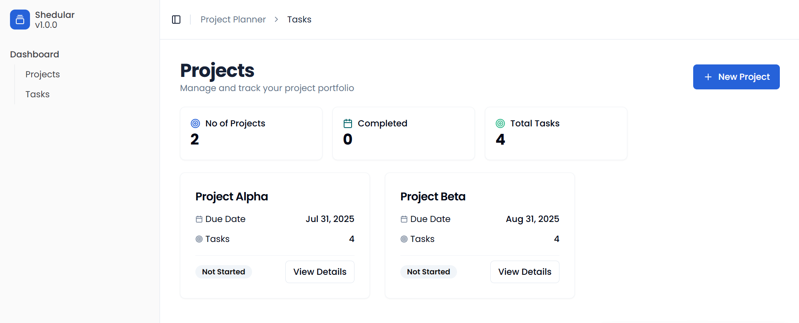
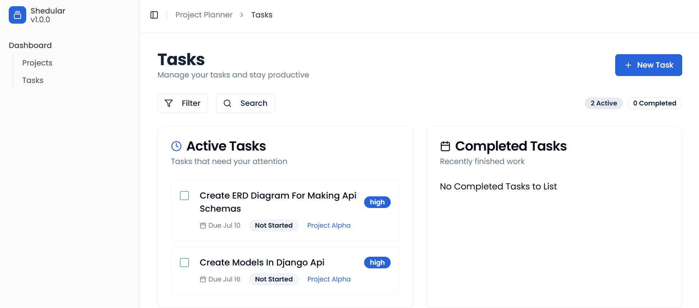

# Resource Management

Follow these steps:

```sh
# Step 1: Clone the repository using the project's Git URL.
git clone https://github.com/vishnu2646/MediphoreScheduler

# Step 2: Navigate to the project directory.
cd MediphoreScheduler

# Step 3: Install the necessary dependencies.
npm i

# Step 4: Start the development server with auto-reloading and an instant preview.
npm run dev
```

## Where can I find API?
Backend Repository can be found [Repo Link](https://github.com/vishnu2646/MediPhoreSchedulerApi)

## What Technologies are used for this project?

This project is built with:

- Vite
- TypeScript
- React
- shadcn-ui
- Tailwind CSS
- Django Rest Framework
- Sqlite3

## Screen Shots

#### Projects List Screen



#### Task List Screen



#### Task Details Screen


#### Best Matched Resource List

